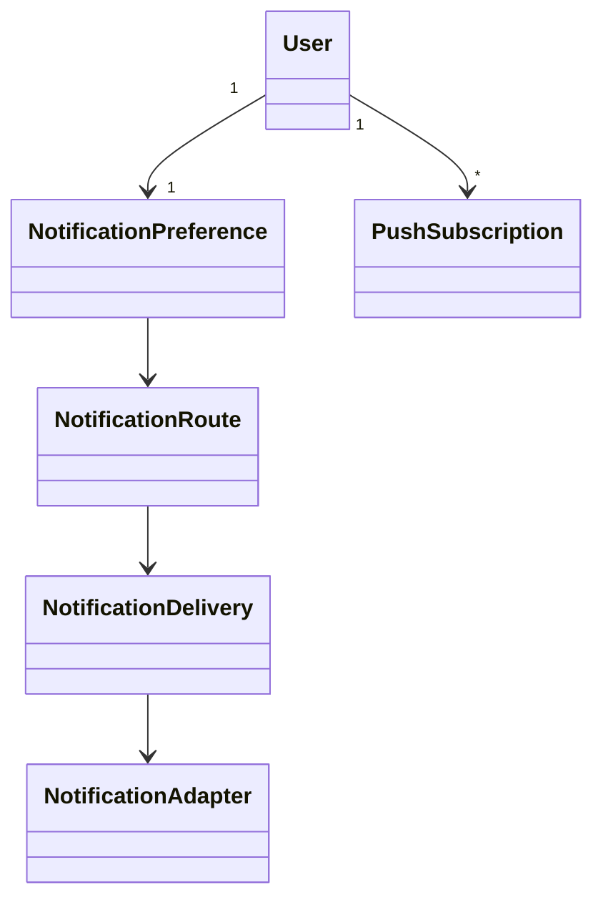

# ADR 0005 - Notifications orientées coût

## Décision

ImmoLib garde une file de livraison unique, mais place les préférences et les
appareils dans un module `notifications` séparé.

L’ordre automatique du MVP est :

1. push Firebase autorisé ;
2. email vérifié via Amazon SES ;
3. WhatsApp seulement après opt-in ;
4. SMS seulement après activation explicite.

Un locataire sans compte ne peut pas recevoir de push. Son email fourni par le
bailleur est alors le seul canal automatique gratuit. WhatsApp, email local,
partage natif et copie restent disponibles manuellement depuis l’écran
Documents.

## Structure

`NotificationPreference` contient les choix. `PushSubscription` contient les
jetons FCM. `NotificationDelivery` reste l’outbox fiable avec tentatives et
reprises. Les adaptateurs SES et Firebase n’apparaissent qu’à la frontière
technique.

## Sécurité

- La configuration Firebase côté navigateur est publique, mais les identifiants
  Firebase Admin restent uniquement côté backend.
- Les identifiants AWS suivent la chaîne standard boto3 et ne sont pas stockés
  dans le dépôt.
- L’opt-in WhatsApp est daté.
- Un partage manuel crée un `ManualShareEvent`; ImmoLib ne prétend pas que
  l’application externe a envoyé le message.
- Vérifier l’email ne vérifie jamais le téléphone.

## Hors périmètre

L’intégration WhatsApp Cloud automatique et le fournisseur SMS restent
configurables mais non branchés. Le webhook Mobile Money signé reste
volontairement exclu.

