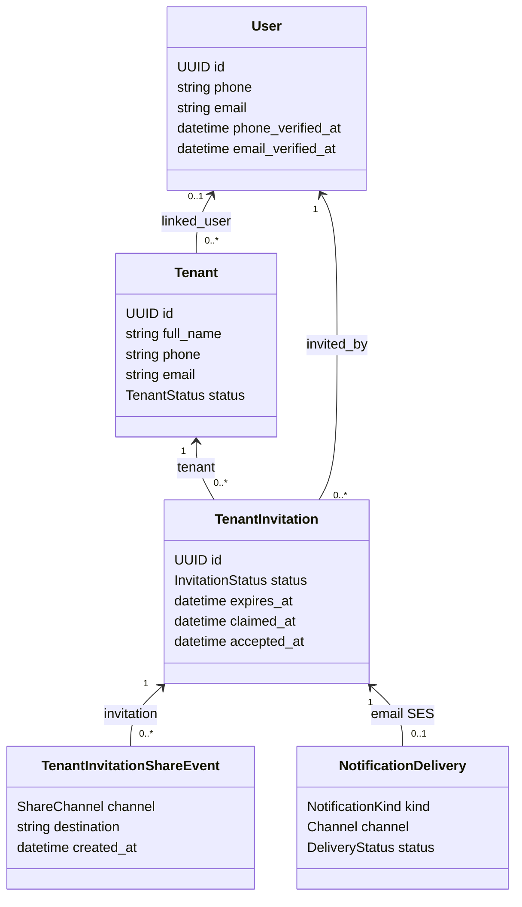
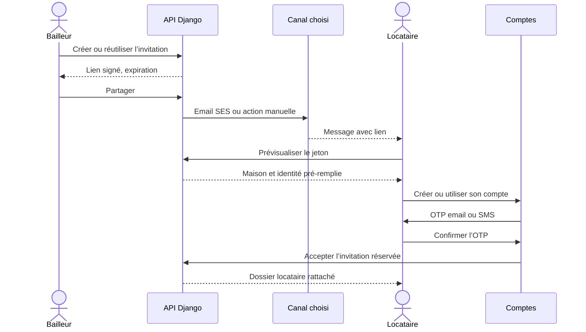

# ADR 0006 — Invitation sécurisée d’un locataire

## Contexte

Un bailleur peut déjà enregistrer un locataire sans lui créer de compte. ImmoLib
doit ensuite permettre à cette personne de rejoindre le service sans dupliquer
son dossier et sans qu’un simple détenteur du lien puisse usurper son identité.

Le MVP reste limité aux maisons. L’intégration Mobile Money par webhook signé
reste volontairement hors du jalon.

## Décision

Une `TenantInvitation` relie un dossier `Tenant` au compte qui l’a invitée,
réclamée puis acceptée. L’URL contient un jeton signé par Django. L’enregistrement
en base conserve le cycle de vie, l’expiration et les acteurs pour l’audit.

Une seule invitation `PENDING` peut exister par locataire. La création est donc
idempotente : un second clic rend la même invitation tant qu’elle reste valide.

## Deux contrôles indépendants

Le parcours sépare :

1. l’authenticité du lien : signature Django, identifiant serveur et expiration ;
2. l’identité du locataire : OTP sur le contact déjà enregistré.

Le lien permet de voir le contexte et de démarrer l’inscription. Il ne suffit
jamais à lier le compte. Si le dossier contient un email, cet email doit
correspondre et être vérifié. Sans email, le numéro doit être vérifié par SMS.
Un compte existant peut réclamer le lien seulement s’il possède déjà l’une de
ces preuves concordantes.

## Partage et coûts

Les canaux manuels (`WHATSAPP`, `EMAIL`, `SMS`, `NATIVE`, `COPY`) préparent une
action sur l’appareil du bailleur et créent un événement d’audit. Ils ne
prétendent pas que le message a été livré.

`EMAIL_AUTOMATIC` crée une `NotificationDelivery` traitée par l’adaptateur
Amazon SES. La file conserve les tentatives et l’état réel de l’envoi.

## Conséquences

- le dossier `Tenant` reste la référence métier, même avant la création du compte ;
- l’inscription ne crée pas un second locataire ;
- une révocation ou une expiration empêche tout nouveau partage ou rattachement ;
- les futurs écrans locataire pourront filtrer les données par `linked_user` ;
- le remplacement de SES ou l’ajout d’un fournisseur SMS ne modifie pas le
  domaine des baux.
