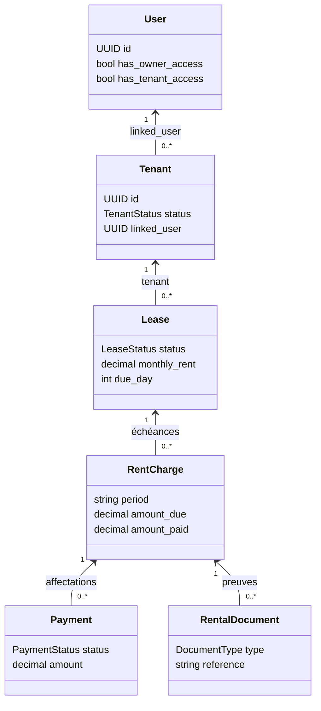
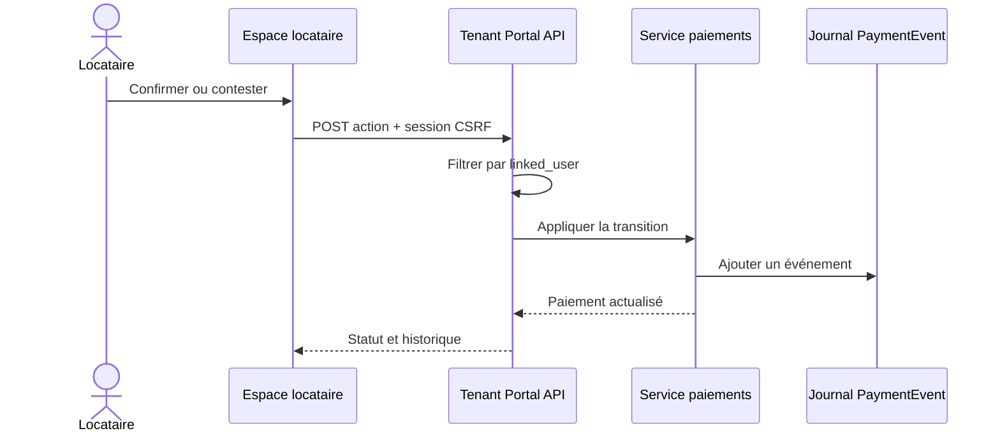

# ADR 0007 — Frontière dédiée à l’espace locataire

## Contexte

Après l’invitation du jalon 20, un `User` peut être rattaché à une ou plusieurs
fiches `Tenant`. Le même compte peut aussi être bailleur ou copropriétaire.

Étendre directement les endpoints du bailleur rendrait les permissions
difficiles à lire : une liste pourrait être partagée, alors qu’une action comme
annuler un paiement ou générer une échéance doit rester réservée au bailleur.

## Décision

Le module `tenant_portal` est une frontière de lecture et d’action dédiée. Il ne
duplique pas les modèles métier. Ses sélecteurs composent les domaines existants
par la relation `Tenant.linked_user`.

Les routes commencent par `/api/v1/tenant-portal/`. Elles sont séparées des
routes `/payments/`, `/leases/` et `/documents/` utilisées par le bailleur.

## Invariants d’autorisation

- seul un `Tenant` `ACTIVE` et lié à la session ouvre l’accès ;
- un bail `DRAFT` ou `CANCELLED` n’est jamais présenté au locataire ;
- un bail `ENDED` reste consultable pour conserver l’historique ;
- chaque paiement, échéance, document et PDF est filtré par `linked_user` ;
- un locataire `BLOCKED` perd l’accès, sans supprimer l’historique ;
- `has_owner_access` et `has_tenant_access` ne remplacent jamais les sélecteurs
  serveur.

## Réponse à un paiement

Une contestation exige un motif. La confirmation et la contestation réutilisent
les services du domaine des paiements, déjà utilisés par l’accès public OTP.
Cela donne une seule règle métier, quel que soit le parcours.

## Synthèse et évolution

L’endpoint `overview` retourne les profils, baux actifs, prochaine échéance,
compteurs et soldes regroupés par devise. Ce regroupement évite de supposer que
tous les futurs pays utiliseront le XOF.

Les listes restent séparées afin de permettre plus tard pagination, filtres et
chargement progressif sans modifier la synthèse.

## Évolution au jalon 22

Le portail ne déclenche toujours pas de paiement et ImmoLib ne détient pas les
fonds. Le jalon 22, décrit par l'ADR 0008, ajoute toutefois la réception
automatique d'une confirmation Mobile Money par webhook signé et le module
d'incidents partagé avec le bailleur.
