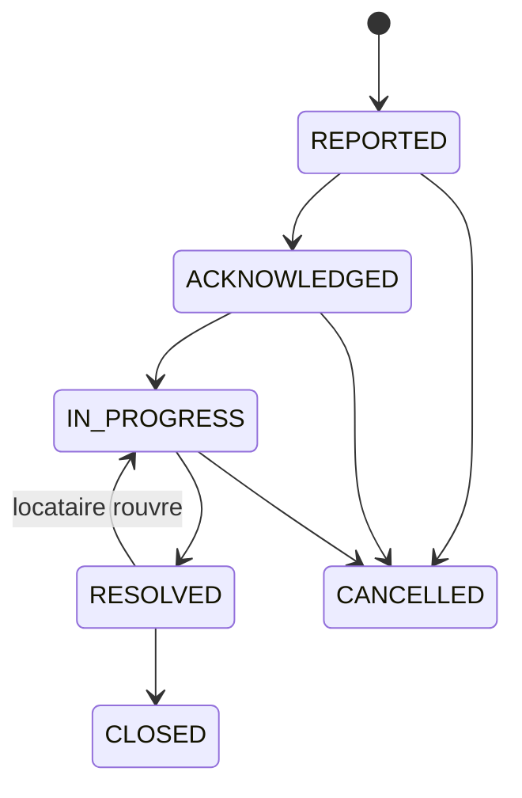
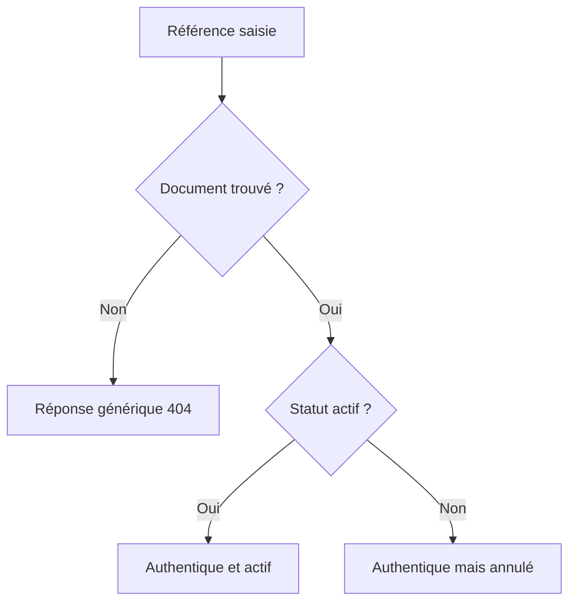
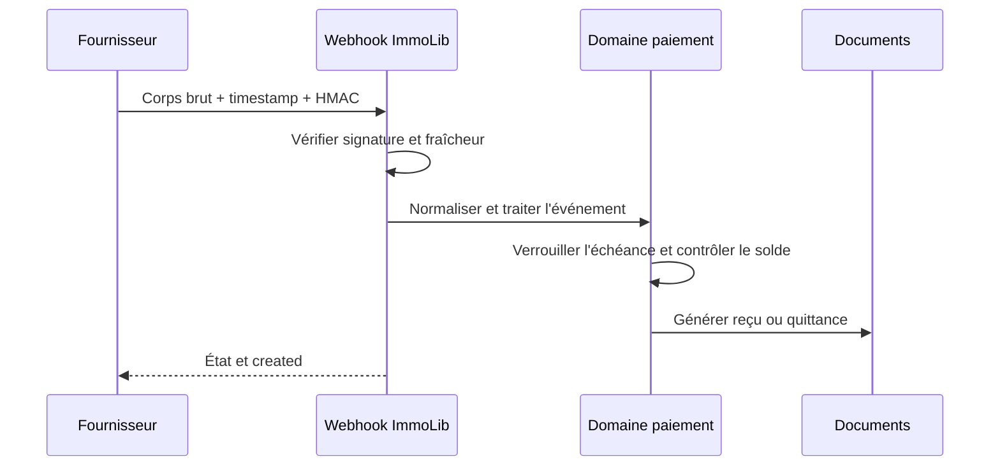

# ADR 0008 — Incidents, vérification publique et webhook signé

## Contexte

Le jalon 21 a séparé les espaces bailleur et locataire. Trois besoins complètent
maintenant cette frontière :

1. suivre un problème matériel sans perdre les échanges ;
2. permettre à un tiers de contrôler un document sans créer de compte ;
3. accepter la confirmation automatique d'un paiement Mobile Money, sans que
   ImmoLib ne détienne les fonds.

Ces flux ont des niveaux de confiance différents. Un commentaire d'entretien
vient d'un utilisateur connecté, une vérification de référence est publique et
un paiement automatique vient d'un système externe.

## Décision 1 — Un incident possède un état et un journal append-only

`MaintenanceIncident` contient l'état courant. `MaintenanceEvent` conserve les
signalements, transitions et commentaires dans l'ordre chronologique.

Le bailleur pilote `ACKNOWLEDGED`, `IN_PROGRESS`, `RESOLVED` et `CANCELLED`.
Le locataire peut seulement confirmer `CLOSED` ou revenir à `IN_PROGRESS`
depuis `RESOLVED`. La réouverture exige un motif. Une clôture par le locataire
évite que le bailleur puisse déclarer seul le dossier définitivement terminé.

L'incident appartient à un bail, donc à une maison et à un locataire précis.
Les services vérifient cette cohérence et les sélecteurs appliquent les mêmes
frontières que le reste de l'application :

- propriétaire principal et copropriétaire actif peuvent agir ;
- copropriétaire observateur peut lire ;
- locataire lié au bail peut lire et répondre ;
- un autre utilisateur ne voit rien.

## Décision 2 — Vérifier une référence sans ouvrir le document complet

`GET /api/v1/public-access/verify-reference/?reference=...` ne demande pas de
session. La réponse contient seulement les informations nécessaires au contrôle
et jamais le téléphone, l'identifiant du paiement ou l'identifiant de
l'échéance.

Le débit anonyme est limité à 30 requêtes par minute. Cette page ne remplace
pas le lien sécurisé avec OTP : la référence sert au contrôle, tandis que l'OTP
autorise la consultation et le téléchargement du document complet.

## Décision 3 — Un contrat webhook générique, signé et idempotent

Le premier point d'entrée Mobile Money reste indépendant d'un opérateur. Un
adaptateur traduira ultérieurement le format du fournisseur vers un contrat
interne stable.

La signature est un HMAC-SHA256 de `timestamp + "." + corps HTTP brut`. La
comparaison est constante et le timestamp doit rester dans la tolérance
configurée, 300 secondes par défaut.

L'unicité `(provider, external_event_id)` empêche le double encaissement. Une
nouvelle livraison du même événement retourne le résultat existant. Le même
identifiant avec un corps différent est rejeté grâce au condensat du payload.

Seul `SUCCEEDED` crée un paiement :

- méthode `MOBILE_MONEY` ;
- état `CONFIRMED_BY_PROVIDER` ;
- affectation à l'échéance ;
- recalcul atomique du solde ;
- événement d'audit ;
- émission du reçu et, si le mois est soldé, de la quittance.

Les paiements confirmés par le fournisseur ne peuvent être ni contestés par le
locataire ni annulés manuellement par le bailleur. Une correction doit arriver
par un futur flux fournisseur explicite, pas par la modification silencieuse
d'une preuve.

## Conséquences et limites

- ImmoLib orchestre des preuves, mais ne conserve pas les fonds.
- Le secret est obligatoire et reste dans l'environnement.
- Aucun nom d'opérateur, identifiant réel ou clé réelle n'est versionné.
- Le contrat actuel n'est pas encore l'intégration d'un PSP précis : avant la
  production, il faudra adapter son format, sa procédure de signature, ses
  statuts et sa stratégie de remboursement.
- Les pièces jointes et l'affectation d'un artisan restent des évolutions
  possibles du module de maintenance.

