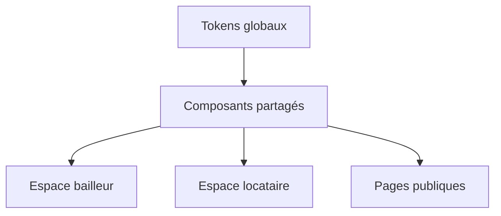

# ADR 0009 — Système d'interface sobre et orienté usage

## Contexte

Les premiers écrans d'ImmoLib ont permis de valider les parcours métier, mais
leur langage visuel accumulait plusieurs couleurs d'accent, des ombres, des
blocs très arrondis et des cartes presque partout. L'ensemble ressemblait plus
à une démonstration générée qu'à un outil de gestion quotidien.

La refonte s'inspire de la sobriété éditoriale et de la palette principale de
[MeetSponsors](https://meetsponsors.com/fr), sans reproduire sa structure ni ses
contenus. ImmoLib conserve sa propre identité et ses contraintes de gestion
locative.

## Décision

L'interface utilise désormais quatre niveaux visuels principaux :

| Rôle | Couleur | Usage |
| --- | --- | --- |
| Marque | `#D4342B` | CTA, liens actifs, logo et focus |
| Encre | `#121012` | Titres, navigation active et données importantes |
| Fond chaud | `#F9F6F5` | Arrière-plan et zones secondaires |
| Ligne | `#E5DFDC` | Séparation, tableaux et contours |

Le rouge de marque n'est pas utilisé pour signifier « paiement réussi ». Les
états métier gardent des teintes sémantiques discrètes :

- vert doux pour un élément payé, actif ou vérifié ;
- ambre doux pour une attente ou une action nécessaire ;
- rouge clair pour une erreur, un retard ou une annulation ;
- gris chaud pour un état neutre.

## Composants partagés

Les classes de `globals.css` portent l'essentiel de la cohérence :

- `.panel` : surface plate, bordure fine, rayon de 14 px, sans ombre ;
- `.primary-button` : rouge, hauteur minimale de 44 px ;
- `.secondary-button` : blanc, bordure et survol neutre ;
- `.form-input` : bordure plus lisible et focus rouge ;
- `.metric-card` : information chiffrée sans décoration colorée ;
- `.status-pill` : petite étiquette réservée aux états.

Modifier ces primitives propage la refonte sur les maisons, locataires, baux,
échéances, paiements, documents, copropriétaires, incidents et notifications.

## Hiérarchie et navigation

Les espaces bailleur et locataire utilisent :

- une largeur de lecture limitée à 1 380 px ;
- une barre latérale de 240 px sur grand écran ;
- des liens actifs distingués par le fond neutre et une icône rouge ;
- un menu mobile dépliable, plutôt qu'une longue ligne horizontale à faire
  défiler ;
- une seule police avec quatre niveaux de poids utiles.

## Landing page

La page publique ne présente plus une collection de cartes génériques. Son
ordre répond aux questions d'un visiteur :

1. quel problème ImmoLib résout ;
2. ce que le produit permet réellement ;
3. comment commencer avec une maison ;
4. ce que voient bailleur et locataire ;
5. comment vérifier une quittance ;
6. quelle action effectuer ensuite.

Les promesses restent limitées aux fonctionnalités existantes. Aucun chiffre
d'utilisateur, témoignage ou tarif inventé n'est affiché.

## Visualisation

Le tableau de bord utilise Recharts pour comparer le montant attendu et le
montant encaissé par mois. Deux séries seulement sont affichées :

- gris neutre pour l'attendu ;
- rouge ImmoLib pour l'encaissé.

Le graphique complète les montants exacts, il ne les remplace pas. Une
description accessible et un texte d'explication restent présents.

## Accessibilité

- contraste du bouton principal sur blanc : environ `4.85:1` ;
- contraste du texte principal sur le fond chaud : environ `17.6:1` ;
- zones d'action d'au moins 44 px ;
- focus clavier visible ;
- titres de page uniques et un seul `h1` par vue ;
- tableaux défilables horizontalement sur petit écran ;
- réduction des animations lorsque le système le demande.

## Conséquences

Les prochaines interfaces doivent réutiliser ces tokens avant d'introduire une
nouvelle couleur, une ombre ou un rayon. Une nouvelle couleur n'est justifiée
que par un état métier impossible à distinguer autrement.

