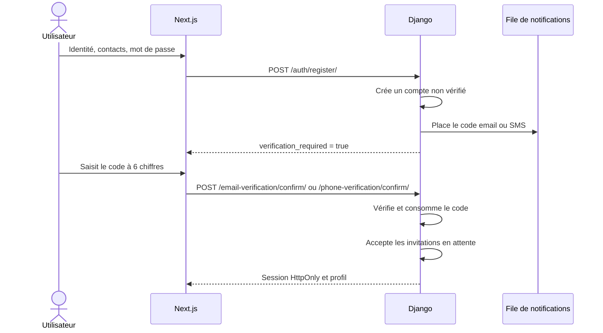

# Authentification du backend ImmoLib

ImmoLib utilise les sessions Django. Le navigateur conserve seulement un
identifiant de session dans un cookie `HttpOnly`; les informations du compte et
les droits restent du côté du serveur.

## Endpoints

| Méthode | URL | Accès | Rôle |
| --- | --- | --- | --- |
| `GET` | `/api/v1/auth/csrf/` | Public | Prépare le cookie et renvoie le jeton CSRF |
| `POST` | `/api/v1/auth/register/` | Public + CSRF | Crée un compte non vérifié et met un code email ou SMS en file |
| `POST` | `/api/v1/auth/phone-verification/request/` | Public + CSRF | Demande ou renvoie le code d’activation |
| `POST` | `/api/v1/auth/phone-verification/confirm/` | Public + CSRF | Vérifie le code et ouvre la session |
| `POST` | `/api/v1/auth/password-reset/request/` | Public + CSRF | Demande un code avec une réponse non révélatrice |
| `POST` | `/api/v1/auth/password-reset/confirm/` | Public + CSRF | Change le mot de passe avec un code valide |
| `POST` | `/api/v1/auth/login/` | Public + CSRF | Vérifie téléphone/mot de passe et ouvre une session |
| `GET` | `/api/v1/auth/me/` | Session requise | Renvoie le profil connecté |
| `POST` | `/api/v1/auth/logout/` | Session + CSRF | Ferme la session |

Toutes les requêtes d’écriture utilisent la protection CSRF.

Le profil renvoyé expose aussi `has_owner_access` et `has_tenant_access`. Ces
indicateurs servent seulement à orienter la navigation et à proposer le
changement d’espace. Les permissions réelles sont recalculées par chaque
endpoint Django.

## Inscription et vérification

Le mot de passe passe par les validateurs natifs de Django. Une invitation de
copropriétaire n’est jamais acceptée avant la preuve de possession du téléphone.
Une invitation locataire exige la preuve du contact correspondant au dossier :
email vérifié si un email avait été enregistré, ou téléphone vérifié sinon.

## Cycle de vie d’un code de compte

- durée par défaut : 10 minutes ;
- délai minimal entre deux émissions : 60 secondes ;
- cinq essais au maximum ;
- usage unique grâce à `consumed_at` ;
- code dérivé avec `salted_hmac`, jamais stocké en clair ;
- SMS créé dans `NotificationDelivery`, comme les autres messages ImmoLib.

Les valeurs sont configurables avec `IMMOLIB_ACCOUNT_OTP_LIFETIME_SECONDS`,
`IMMOLIB_ACCOUNT_OTP_COOLDOWN_SECONDS` et `IMMOLIB_ACCOUNT_OTP_MAX_ATTEMPTS`.
`EXPOSE_TEST_OTP` doit rester désactivé en production.

## Récupération du mot de passe

La demande renvoie toujours le même message, que le numéro soit absent, inactif
ou utilisable. Cette réponse évite d’utiliser l’écran pour découvrir les comptes
existants. Seul un compte actif dont le téléphone est déjà vérifié reçoit un code.

Une confirmation correcte modifie le mot de passe et consomme le code. Le même
code ne peut donc pas être rejoué. Le changement invalide naturellement les
anciennes sessions Django via le hash d’authentification du compte.

## Où lire le code

1. `modules/accounts/models.py` contient `User` et `AccountOtpChallenge`.
2. `modules/accounts/services.py` porte émission, vérification et consommation.
3. `modules/accounts/api/serializers.py` valide les données et les mots de passe.
4. `modules/accounts/api/views.py` gère CSRF, réponses publiques et sessions.
5. `modules/documents/notifications.py` construit le SMS au moment de l’envoi.
6. `modules/accounts/tests/test_api.py` décrit les comportements de sécurité.

## Évolution Mobile Money

Ce jalon d'authentification n'intégrait pas Mobile Money. Le jalon 22 ajoute un
point d'entrée système séparé, protégé par HMAC et sans session utilisateur.
Voir l'ADR 0008 pour le contrat, l'idempotence et les limites.
