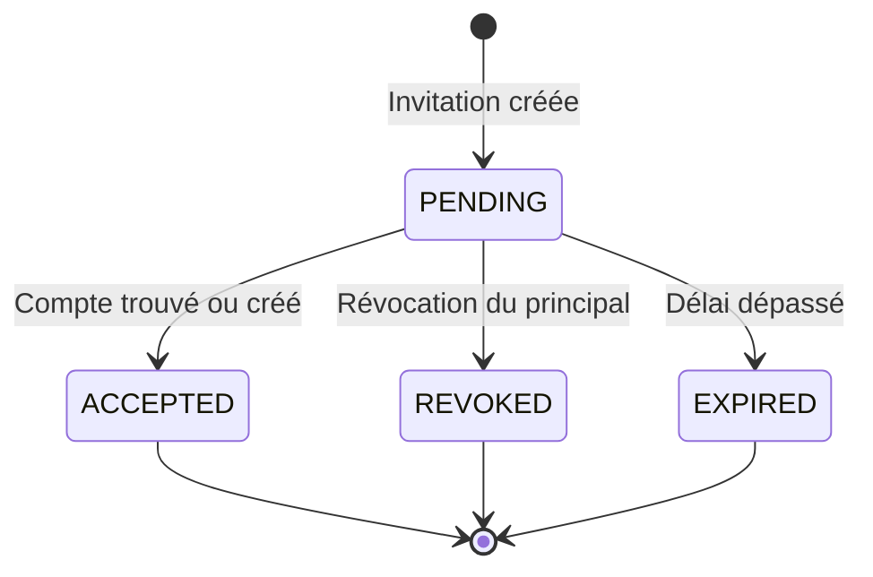

# Gestion backend des copropriétaires

Ce jalon sépare trois notions :

- le propriétaire principal, unique pour une maison ;
- le copropriétaire, qui possède éventuellement une quote-part ;
- le niveau d’accès, qui autorise l’action ou seulement la consultation.

## Règles métier

1. Seul le propriétaire principal invite, modifie ou retire un copropriétaire.
2. Une invitation cible un numéro de téléphone et expire après 30 jours.
3. Si le compte existe déjà, l’invitation est acceptée immédiatement.
4. Sinon, elle est acceptée automatiquement lors de l’inscription du compte.
5. Les invitations en attente réservent leur quote-part pour éviter de dépasser 100 %.
6. La somme des copropriétaires reste strictement inférieure à 100 %.
7. La quote-part du propriétaire principal est recalculée automatiquement.
8. Le niveau `ACTIVE` permet d’agir ; `OBSERVER` permet seulement de consulter.

## Cycle d’une invitation



## Endpoints

| Méthode | URL | Rôle |
| --- | --- | --- |
| `GET` | `/api/v1/co-owner-invitations/` | Lister les invitations envoyées |
| `POST` | `/api/v1/co-owner-invitations/` | Inviter un copropriétaire |
| `GET` | `/api/v1/co-owner-invitations/{id}/` | Consulter une invitation |
| `POST` | `/api/v1/co-owner-invitations/{id}/revoke/` | Révoquer une invitation en attente |
| `GET` | `/api/v1/co-owners/` | Lister les copropriétaires gérables |
| `PATCH` | `/api/v1/co-owners/{id}/` | Modifier accès ou quote-part |
| `DELETE` | `/api/v1/co-owners/{id}/` | Retirer le copropriétaire |

Les listes acceptent `?house_id=<uuid>`. Les invitations acceptent aussi
`?status=PENDING`.

## Exemple d’invitation

```json
{
  "house_id": "uuid-de-la-maison",
  "phone": "+2250700000000",
  "email": "coproprietaire@example.com",
  "ownership_percentage": "40.00",
  "access_level": "OBSERVER"
}
```

Après acceptation, le propriétaire principal passe automatiquement à 60 %.

## Fichiers importants

1. `modules/properties/models.py` contient `Ownership` et `CoOwnerInvitation`.
2. `modules/properties/services.py` porte toutes les règles et transactions.
3. `modules/properties/selectors.py` limite la gestion au propriétaire principal.
4. `modules/properties/api/views.py` expose les endpoints.
5. `modules/properties/tests/test_coowners_api.py` vérifie les permissions et quote-parts.

L’envoi réel de l’invitation par SMS, email ou WhatsApp sera branché avec les
adaptateurs de notification. Aucun webhook Mobile Money n’est concerné.
