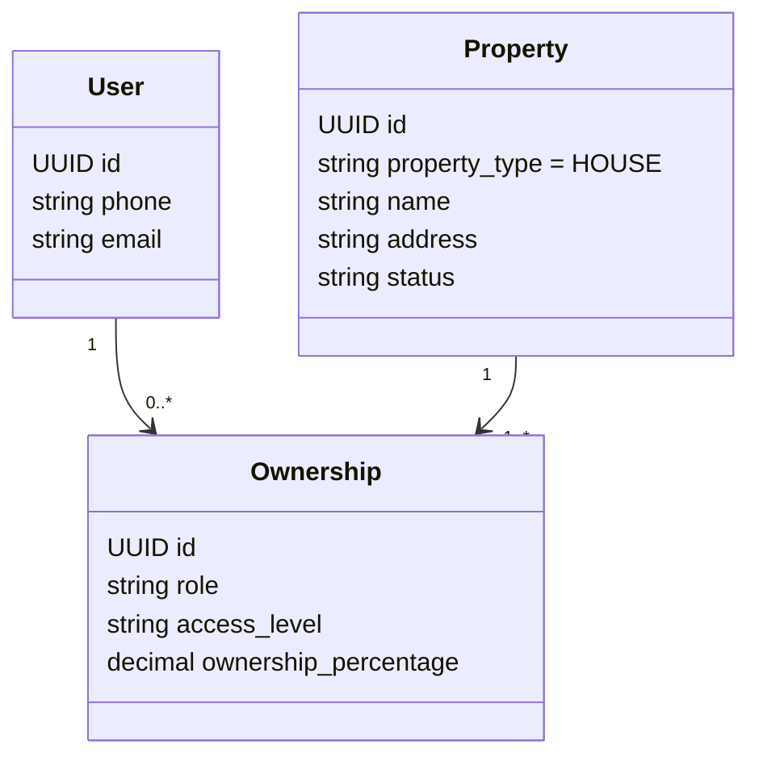
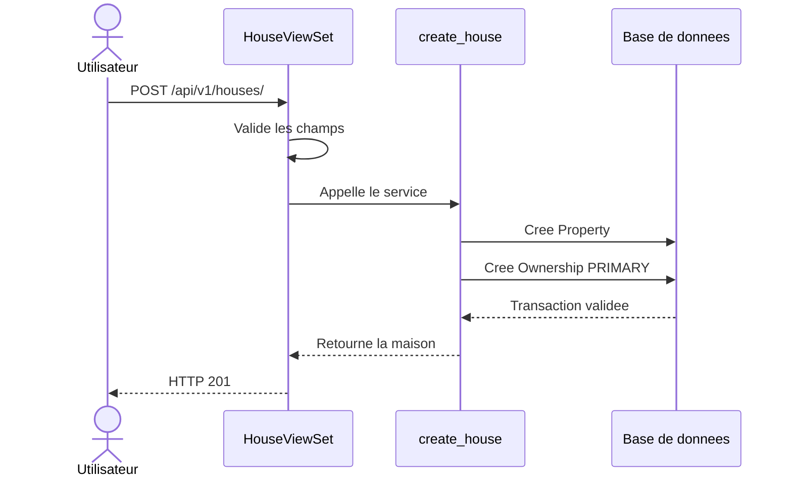

# Comprendre le premier code ImmoLib

## Ce que ce jalon sait faire

1. Creer un compte identifie par son telephone.
2. Creer une maison.
3. Ajouter automatiquement le createur comme proprietaire principal actif.
4. Ajouter des coproprietaires dans l'administration Django.
5. Empecher deux proprietaires principaux pour la meme maison.
6. Empecher un utilisateur d'etre ajoute deux fois a la meme maison.
7. Retourner uniquement les maisons de l'utilisateur connecte.

## Les trois modeles



`Ownership` est la liaison entre une personne et une maison. Elle contient les
informations qui n'appartiennent ni uniquement a la personne, ni uniquement a
la maison : role, niveau d'acces et quote-part.

## Pourquoi le modele s'appelle Property

Le MVP affiche seulement le mot **Maison**. En interne, `Property` rend possible
l'ajout futur d'autres types sans modifier toutes les relations.

Pour l'instant, un seul choix existe :

```python
class Type(models.TextChoices):
    HOUSE = "HOUSE", "Maison"
```

Ajouter un type dans le futur sera une decision produit explicite.

## Parcours d'une creation



La vue HTTP ne cree pas directement les objets. La fonction `create_house`
porte la regle metier et utilise `transaction.atomic` : si la creation du
proprietaire echoue, la maison est egalement annulee.

## Protection des donnees

Dans `HouseViewSet`, la requete commence par :

```python
Property.objects.filter(ownerships__user=self.request.user)
```

Cette ligne est fondamentale. Elle interdit de lister ou consulter une maison
sans lien de propriete avec l'utilisateur connecte.

## Fichiers a lire dans l'ordre

1. `apps/api/modules/accounts/models.py`
2. `apps/api/modules/properties/models.py`
3. `apps/api/modules/properties/services.py`
4. `apps/api/modules/properties/api/serializers.py`
5. `apps/api/modules/properties/api/views.py`
6. `apps/api/modules/properties/tests/`

Les tests constituent des exemples executables des regles metier.
