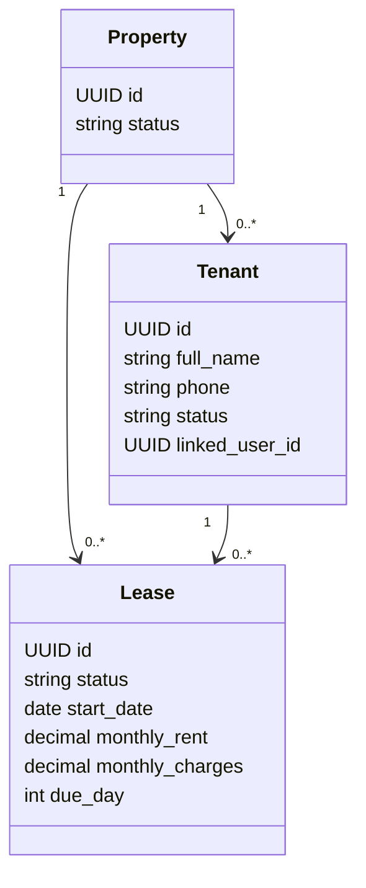
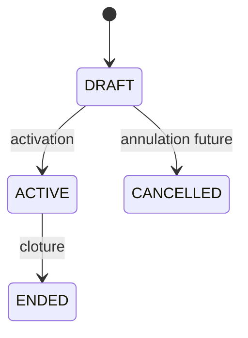

# Comprendre les locataires et les baux

## Pourquoi le locataire appartient a une maison

Dans le MVP, le bailleur peut enregistrer un locataire qui ne possede pas
encore de compte ImmoLib. Le modele `Tenant` est donc une fiche rattachee a une
maison, et non un compte de connexion.

`linked_user_id` reste vide tant que le locataire n'a pas verifie son telephone
et active son compte. Cette liaison sera ajoutee lors du parcours d'invitation.

## Pourquoi le bail commence comme brouillon

Creer et activer sont deux operations differentes :

1. le bailleur saisit les conditions ;
2. il peut les relire et les corriger ;
3. il active le bail lorsqu'elles sont confirmees ;
4. la maison devient alors occupee.

Le statut `CANCELLED` existe dans le modele, mais aucun endpoint ne l'utilise
encore. Il ne faut pas ajouter une fonction avant d'avoir defini sa regle
metier.

## Regles deja protegees

- Le jour d'echeance est compris entre 1 et 28.
- Le loyer est strictement positif.
- Les charges, la caution et l'avance ne peuvent pas etre negatives.
- Le locataire et le bail doivent appartenir a la meme maison.
- Une maison ne peut avoir qu'un seul bail actif.
- Un coproprietaire observateur peut consulter mais pas modifier.
- Cloturer un bail conserve l'historique et rend la maison vacante.

## Fichiers a lire dans l'ordre

1. `apps/api/modules/leases/models.py`
2. `apps/api/modules/leases/selectors.py`
3. `apps/api/modules/leases/services.py`
4. `apps/api/modules/leases/api/serializers.py`
5. `apps/api/modules/leases/api/views.py`
6. `apps/api/modules/leases/tests/`

Les `selectors` centralisent les lectures autorisees. Les `services`
centralisent les modifications et transactions metier.
