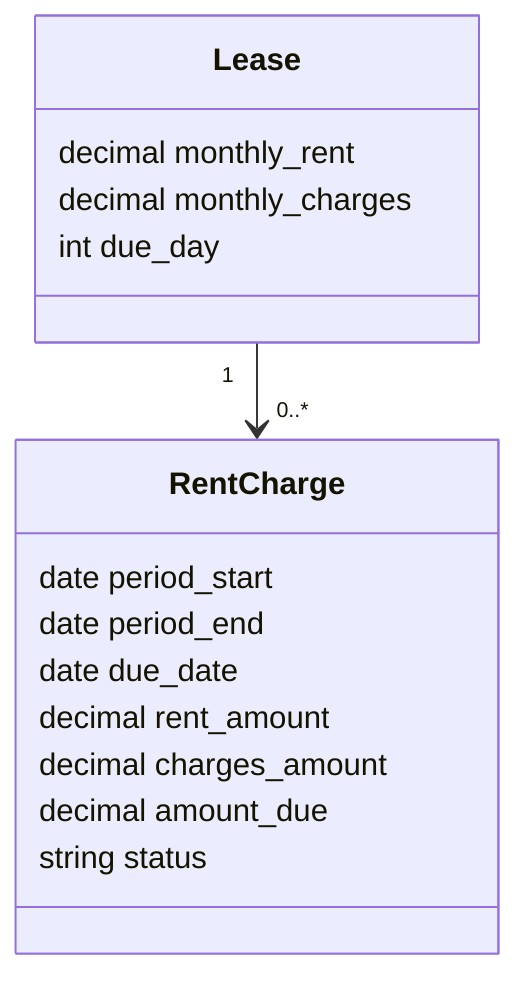
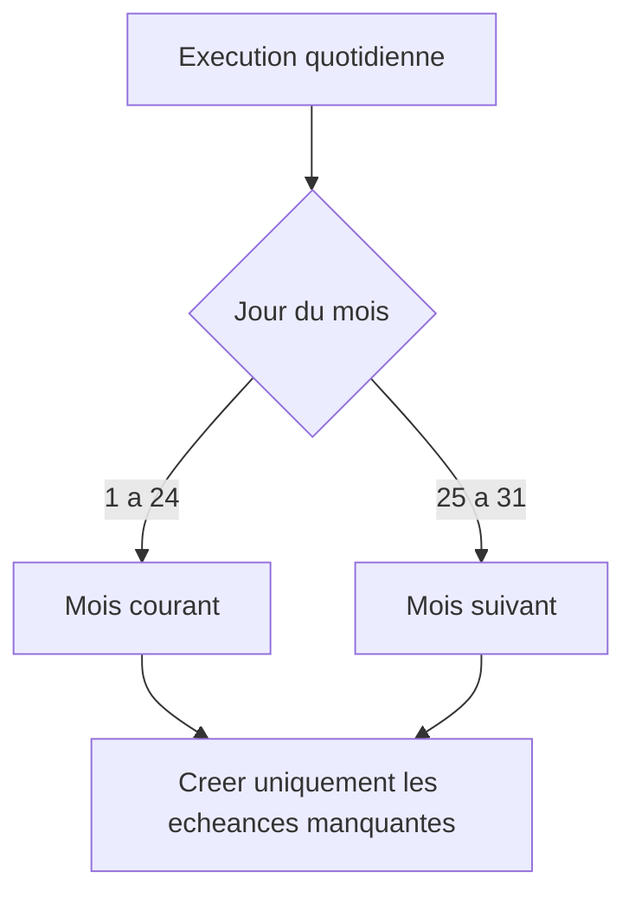

# Comprendre les echeances mensuelles

## Une echeance n'est pas un paiement

L'echeance indique ce qui est attendu. Le paiement indiquera plus tard ce qui a
ete effectivement recu.



Exemple :

```text
Bail : loyer 100 000 FCFA + charges 10 000 FCFA
Echeance d'aout 2026 : 110 000 FCFA, limite le 5 aout
```

## Pourquoi recopier les montants

L'echeance conserve un instantane des conditions du bail. Si le loyer passe a
120 000 FCFA en septembre, l'echeance d'aout reste a 110 000 FCFA. Il ne faut
jamais reecrire silencieusement l'historique financier.

## Generation idempotente

La base interdit deux echeances pour le meme bail et le meme mois :

```text
UNIQUE (lease_id, period_start)
```

La commande automatique peut donc etre relancee apres une panne : les
echeances existantes sont conservees et seules les manquantes sont creees.

## Choix de la periode



En production, `run_billing_cycle` sera execute automatiquement chaque jour par
Celery ou un planificateur equivalent.

## Calcul du statut temporel

```text
Aujourd'hui avant la date limite  -> UPCOMING
Aujourd'hui a la date limite      -> DUE
Aujourd'hui apres la date limite  -> OVERDUE
```

Les futurs statuts `PARTIALLY_PAID`, `PAID` et `DISPUTED` ne seront pas
ecrases par le calendrier. Ils seront controles par le module de paiements.

## Premier mois du bail

Le MVP n'applique pas automatiquement de prorata. Le premier mois est facture
en totalite. Si le bail commence apres le jour habituel de paiement, sa date de
debut devient la date limite du premier mois.

Exemple :

```text
Debut du bail : 20 juillet
Jour habituel : 5
Date limite du premier mois : 20 juillet
```

## Fichiers a lire dans l'ordre

1. `apps/api/modules/billing/models.py`
2. `apps/api/modules/billing/services.py`
3. `apps/api/modules/billing/selectors.py`
4. `apps/api/modules/billing/api/views.py`
5. `apps/api/modules/billing/management/commands/run_billing_cycle.py`
6. `apps/api/modules/billing/tests/`
