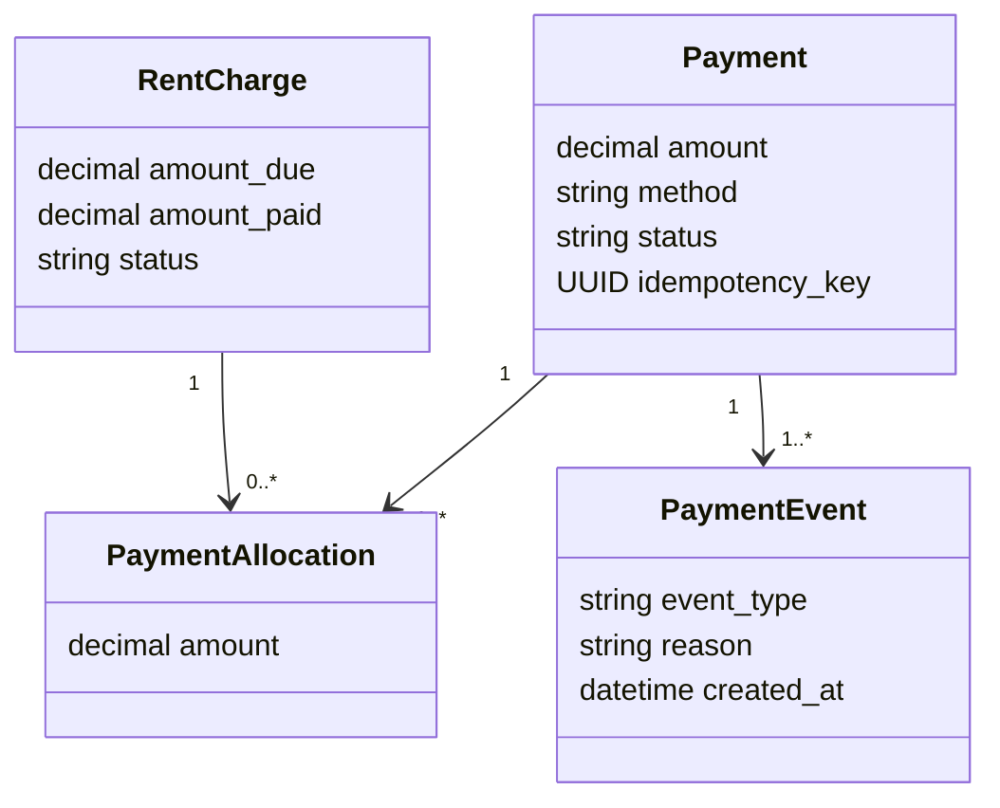
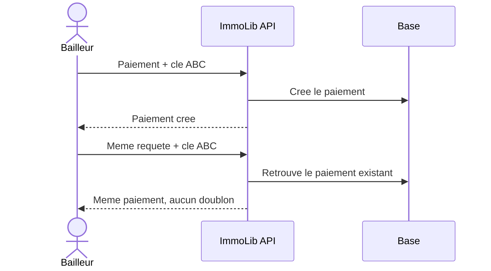
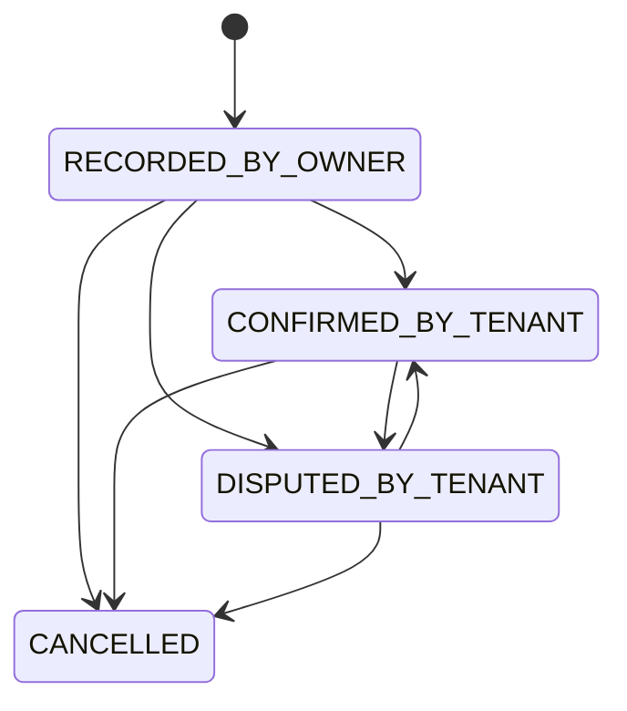

# Comprendre les paiements hors ImmoLib

## Ce que signifie declarer un paiement

Le bailleur a deja recu l'argent, par exemple en especes ou par un virement
externe. ImmoLib ne manipule pas cet argent : l'application enregistre la preuve
et met a jour l'echeance.



## Pourquoi PaymentAllocation existe

Dans le MVP, un paiement vise une seule echeance. La table d'affectation rend
cependant possible, plus tard, la repartition d'un paiement entre plusieurs
mois sans changer le modele `Payment`.

## Paiement partiel

```text
Echeance : 110 000 FCFA
Premier paiement : 40 000 FCFA
Montant paye : 40 000 FCFA
Solde : 70 000 FCFA
Statut : PARTIALLY_PAID
```

Un deuxieme paiement de 70 000 FCFA fait passer l'echeance a `PAID`.
L'API refuse tout montant superieur au solde restant.

## Protection contre les doublons

Chaque tentative contient une `idempotency_key`, generee par l'application
avant l'envoi.



Si la meme cle revient avec un autre montant, l'API refuse la requete.

## Confirmation et contestation



Une contestation reste visible dans `PaymentEvent`, mais le montant continue a
compter puisque le bailleur a confirme l'avoir recu. Un traitement humain pourra
ensuite resoudre le desaccord.

## Annulation

Une erreur de saisie n'efface pas le paiement. Le bailleur fournit un motif,
ImmoLib passe le paiement a `CANCELLED`, ajoute un evenement et recalcule le
solde de l'echeance.

## Ce qui viendra ensuite

- lien securise permettant au locataire sans compte de confirmer ou contester ;
- generation des recus et quittances ;
- paiements Mobile Money confirmes par webhook signe.

## Fichiers a lire dans l'ordre

1. `apps/api/modules/payments/models.py`
2. `apps/api/modules/payments/services.py`
3. `apps/api/modules/payments/selectors.py`
4. `apps/api/modules/payments/api/views.py`
5. `apps/api/modules/payments/tests/`
