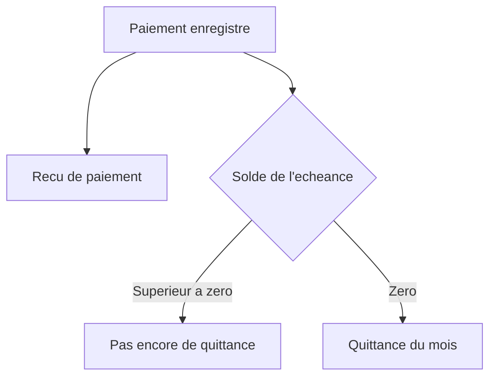
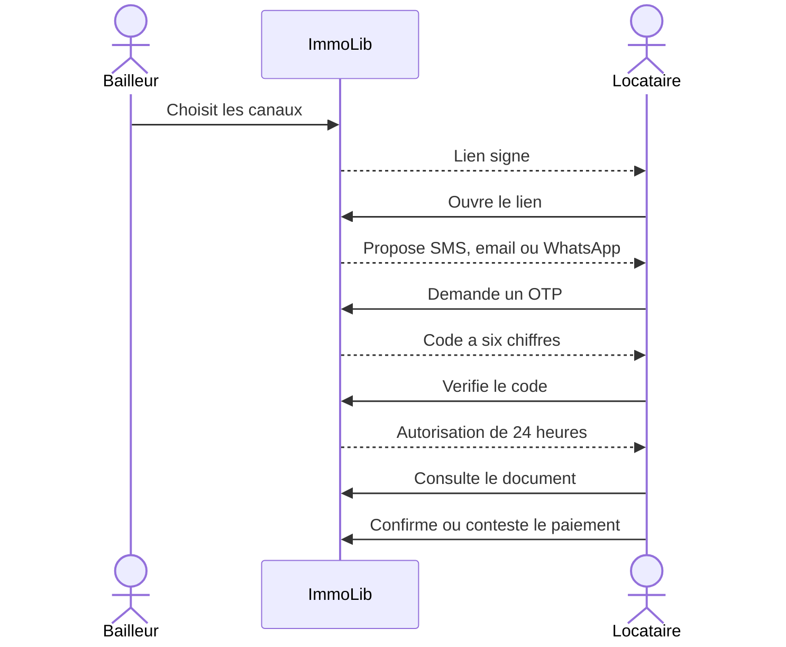

# Comprendre les recus, quittances et liens securises

## Recu ou quittance

```text
Paiement partiel -> recu de paiement
Paiement complet -> recu du dernier paiement + quittance du mois
```

Le recu prouve qu'une somme a ete enregistree. La quittance indique que toute
l'echeance du mois est payee.



## Instantane du document

Le document recopie au moment de son emission :

- le nom et l'adresse de la maison ;
- le bailleur ;
- le locataire ;
- la periode ;
- le montant ;
- la devise ;
- le moyen de paiement.

Changer ensuite le nom du locataire ou l'adresse de la maison ne reecrit pas un
ancien document.

## Annulation sans suppression

Si un paiement est annule, son recu devient `VOIDED`. Si cette annulation rend
le loyer incomplet, la quittance devient egalement `VOIDED`. Les documents
restent dans l'historique avec leur motif d'invalidation.

## Partage multicanal

Le bailleur peut selectionner :

```text
[SMS]
[Email]
[WhatsApp]
[SMS + WhatsApp]
[SMS + Email + WhatsApp]
```

Une ligne `NotificationDelivery` est creee pour chaque canal. Elle est d'abord
`QUEUED`, puis un futur adaptateur la passera a `SENT` ou `FAILED`.

## Parcours du locataire sans compte



## Pourquoi deux jetons

- Le jeton du lien identifie un partage autorise.
- Le jeton d'autorisation prouve que l'OTP a ete verifie.

Le deuxieme ne fonctionne que pendant 24 heures et uniquement pour le document
lie au challenge OTP.

## Regle de contestation

La contestation change le paiement en `DISPUTED_BY_TENANT` et ajoute un
evenement. Conformement a la decision produit, elle ne retire pas
automatiquement le montant que le bailleur affirme avoir recu.

## Fichiers a lire dans l'ordre

1. `apps/api/modules/documents/models.py`
2. `apps/api/modules/documents/services.py`
3. `apps/api/modules/documents/api/views.py`
4. `apps/api/modules/documents/tests/`
5. `apps/api/modules/payments/services.py`
