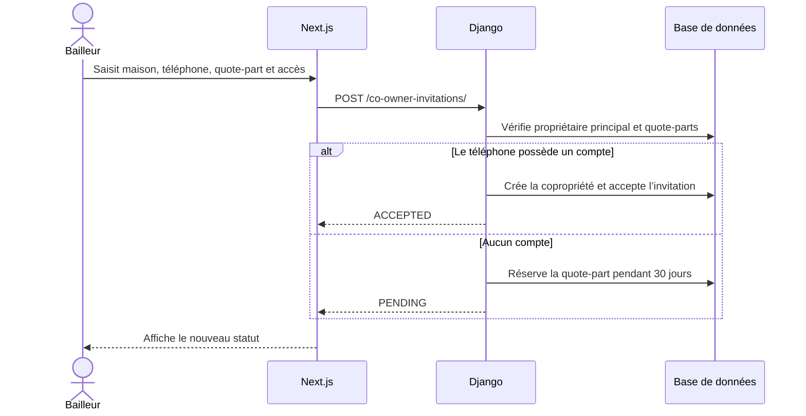

# Comprendre le flux des copropriétaires

Ce jalon relie l’écran Next.js aux règles de copropriété déjà présentes dans
Django. L’interface ne calcule jamais la décision métier finale : elle envoie la
demande et Django vérifie les droits, les doublons et le total des quote-parts.

## Flux d’une invitation

Une invitation `PENDING` réserve déjà sa quote-part. Cela empêche deux invitations
concurrentes de dépasser 100 %. Lors d’une révocation ou d’une expiration, cette
part est libérée. Lors de l’acceptation, elle devient une copropriété réelle.

## Les quatre couches du code

| Couche | Fichier principal | Responsabilité |
| --- | --- | --- |
| Contrats | `apps/web/src/types/domain.ts` | Décrit les objets TypeScript attendus |
| Appels HTTP | `apps/web/src/lib/api-client.ts` | Centralise les URLs et méthodes HTTP |
| Interface | `apps/web/src/components/coowners/coowner-workspace.tsx` | Formulaires, listes, modales et retours utilisateur |
| Règles métier | `apps/api/modules/properties/services.py` | Permissions, quote-parts, acceptation et révocation |

Le composant React utilise `Promise.all` au chargement pour récupérer les maisons,
les copropriétaires, les invitations et l’utilisateur courant. L’identité courante
sert à n’afficher comme gérables que les maisons dont elle est propriétaire
principal.

## Quote-part et niveau d’accès

| Information | Exemple | Effet |
| --- | --- | --- |
| Quote-part | 40 % | Décrit ce que la personne possède |
| `OBSERVER` | Observateur | Peut consulter sans effectuer d’action |
| `ACTIVE` | Actif | Peut utiliser les actions autorisées par le backend |

Modifier `OBSERVER` en `ACTIVE` ne change jamais 40 %. Inversement, modifier 40 %
en 30 % ne change pas le niveau d’accès.

## Synchronisation avec le backend

L’écran appelle Django via `/backend`. Après chaque mutation, il recharge les
trois listes afin d’afficher les valeurs
recalculées par le serveur, notamment la quote-part restante du propriétaire
principal.

Ce flux ne contient aucun webhook ni aucune logique Mobile Money.
