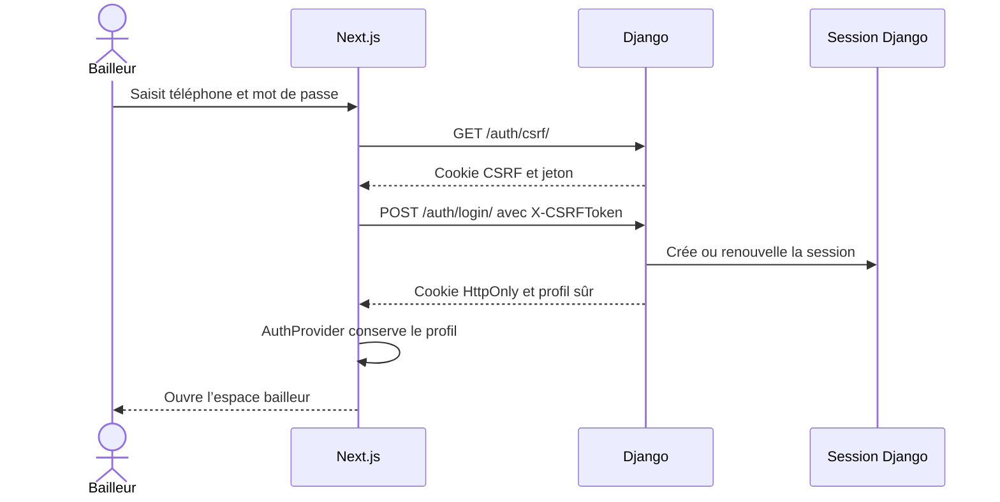

# Comprendre l’authentification frontend

Le navigateur ne stocke jamais le mot de passe ni les permissions. Après une
connexion réussie, Django place un identifiant de session aléatoire dans un cookie
`HttpOnly`. JavaScript ne peut pas lire ce cookie, mais le navigateur l’envoie
automatiquement aux requêtes ImmoLib.

## Séquence complète

L’inscription crée d’abord un compte sans session. Le bailleur saisit ensuite le
code SMS reçu. La session et les invitations de copropriétaire ne deviennent
actives qu’après cette preuve de possession du téléphone.

## Répartition du code

| Fichier | Rôle |
| --- | --- |
| `src/types/domain.ts` | Décrit les formulaires et la réponse `{ user }` |
| `src/lib/api-client.ts` | Prépare CSRF et appelle Django avec les cookies |
| `src/components/auth/auth-provider.tsx` | Source unique de la session React |
| `src/components/auth/login-form.tsx` | Formulaire téléphone/mot de passe |
| `src/components/auth/register-form.tsx` | Formulaire de création du compte |
| `src/components/auth/phone-verification-form.tsx` | Activation et renvoi du code SMS |
| `src/components/auth/password-reset-form.tsx` | Récupération du mot de passe en deux étapes |
| `src/components/app-shell.tsx` | Attente de session, identité et déconnexion |

## Pourquoi `AuthProvider` ?

Sans contexte partagé, chaque écran devrait appeler `/auth/me/` et conserver sa
propre copie de l’utilisateur. `AuthProvider` effectue cette vérification au
chargement puis fournit le même état à toute l’application.

Il expose cinq informations utiles :

- `user` : le profil courant ou `null` ;
- `loading` : la vérification initiale est en cours ;
- `login` ouvre une session et `register` crée le compte non vérifié ;
- `verifyPhone` valide le téléphone puis ouvre la session ;
- `logout` : ferme la session ;
- `refresh` : relit volontairement le profil depuis Django.

## Protection d’un écran

`AppShell` n’affiche pas ses enfants tant que la session réelle n’est pas vérifiée.
Sans utilisateur, il redirige vers `/connexion` en conservant la route demandée
dans `next`. Après connexion, le bailleur revient donc à son écran initial.

Cette protection améliore l’expérience, mais elle n’est pas la sécurité principale.
Un appel direct à l’API reste protégé par `IsAuthenticated` et par les règles de
permission Django.

## CSRF et proxy Next.js

Avant une écriture d’authentification, le client appelle toujours
`GET /auth/csrf/`. Le jeton lisible est envoyé dans `X-CSRFToken`; le cookie de
session demeure `HttpOnly`.

Le proxy `/backend` conserve aussi le slash final. Sans cette règle, Next.js
transformerait par exemple `/auth/login/` en `/auth/login`, et Django refuserait
de rediriger une requête `POST` contenant des données.

Ce jalon ne contient aucune logique ni aucun webhook Mobile Money.
