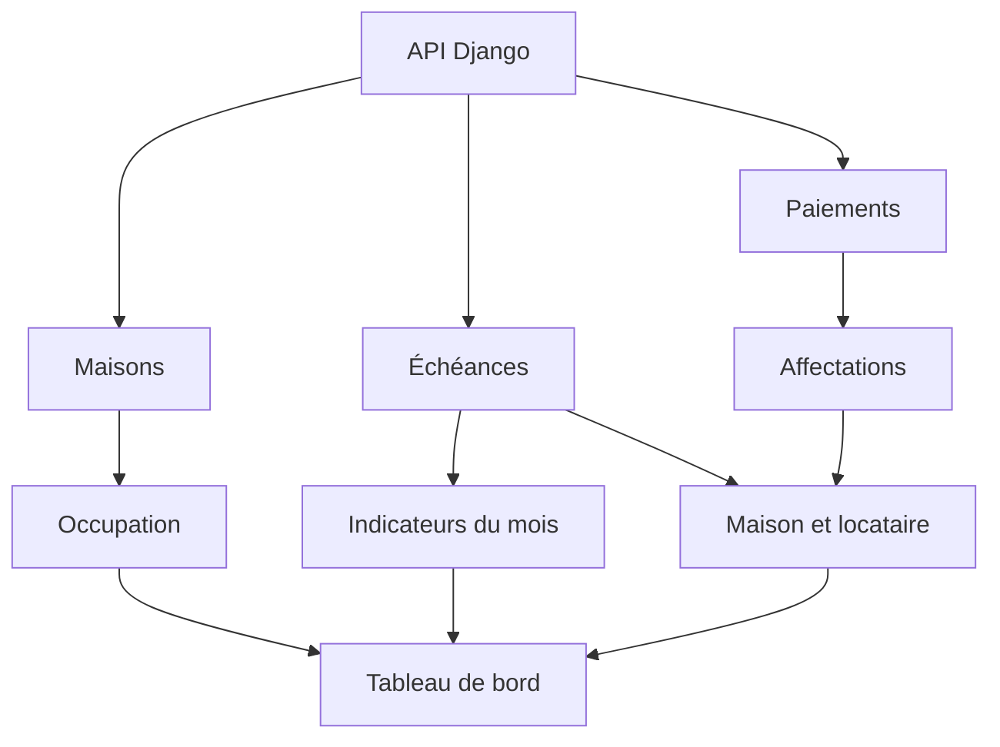

# Comprendre le tableau de bord réel

Le tableau de bord ne possède pas son propre modèle backend. Il assemble trois
listes déjà protégées par Django : les maisons, les échéances et les paiements du
compte connecté.

## Flux de données



`Promise.all` charge les trois ressources en parallèle. Une erreur est affichée
sans remplacer les données déjà présentes, et le bouton « Actualiser » permet de
rejouer le chargement.

## Formules mensuelles

Le composant sélectionne les échéances du mois courant et ignore celles dont le
statut est `CANCELLED`.

| Indicateur | Calcul |
| --- | --- |
| Attendu | somme de `amount_due` |
| Encaissé | somme de `amount_paid` |
| Reste | somme de `balance_due` |
| Taux | encaissé ÷ attendu × 100 |
| Occupées | maisons dont le statut est `OCCUPIED` |

Ces valeurs sont des agrégats d’affichage. Le frontend ne recalcule jamais les
allocations ni le statut financier d’une échéance : ces règles restent dans les
services Django.

## Relier un paiement à une maison

Un paiement peut contenir une ou plusieurs `allocations`. Chaque allocation porte
le `rent_charge_id`. Le tableau de bord construit une table de correspondance des
échéances par identifiant, puis retrouve ainsi le locataire et la maison du
paiement.

```text
Payment -> PaymentAllocation.rent_charge_id -> RentCharge -> maison + locataire
```

Cette relation évite de recopier le nom du locataire et de la maison dans le
modèle de paiement.

## Priorité d’affichage

La liste mensuelle montre au maximum cinq échéances. Elle place d’abord les
retards et contestations, puis les paiements partiels, les échéances dues, celles
à venir et enfin celles déjà payées.

Les cinq derniers paiements sont triés par `received_at`. Les paiements annulés
restent visibles dans l’historique avec leur statut, mais leur montant n’est plus
compté dans `amount_paid` par Django.

## Source des indicateurs

Le tableau de bord utilise les types `House`, `RentCharge` et `Payment` renvoyés
par l’API. Les anciens totaux écrits manuellement ont été retirés afin d’empêcher
le dashboard de diverger des écrans Échéances et Paiements.

Le webhook Mobile Money signé ne fait pas partie de ce jalon.
