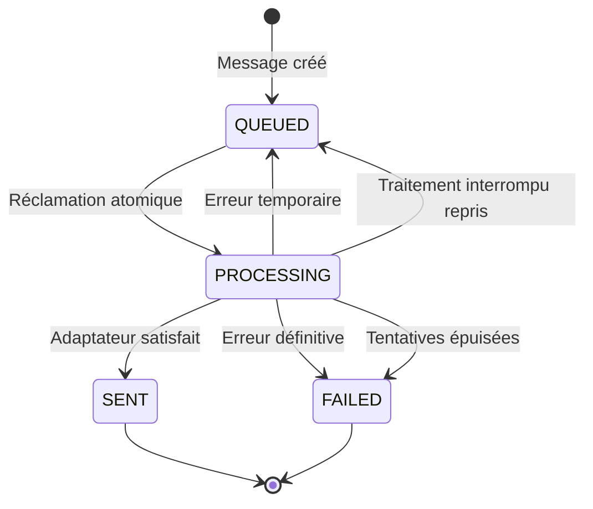

# Comprendre la file de notifications

ImmoLib crée une ligne `NotificationDelivery` pour chaque canal choisi. Un partage
par SMS, email et WhatsApp produit donc trois messages indépendants. L’échec d’un
canal ne bloque pas les deux autres.

## Cycle d’un message



`PROCESSING` empêche deux exécutions normales de traiter le même message. Une mise
à jour conditionnelle réclame la ligne seulement si elle est encore `QUEUED`.
Un traitement resté bloqué plus de cinq minutes est récupéré au lancement suivant.

## Données techniques ajoutées

| Champ | Rôle |
| --- | --- |
| `attempt_count` | Nombre de tentatives commencées |
| `last_attempt_at` | Heure de la dernière réclamation |
| `next_attempt_at` | Première heure autorisée pour le prochain essai |
| `provider_reference` | Identifiant retourné par le fournisseur |
| `failure_reason` | Erreur technique courte pour le diagnostic |

Avec les réglages par défaut, ImmoLib essaie au maximum trois fois. Le délai est
exponentiel : 60 secondes avant le deuxième essai, puis 120 secondes avant le
troisième.

## Construction tardive du contenu

Le texte n’est pas stocké dans la file. `build_notification_message` le construit
au dernier moment à partir du document ou du défi OTP :

- le lien sécurisé est signé de nouveau depuis `DocumentAccessLink` ;
- le code OTP est dérivé de l’identifiant du défi ;
- un lien révoqué, un document invalidé ou un OTP expiré produit un échec définitif.

Cette approche évite de conserver une copie supplémentaire du code OTP et empêche
l’envoi tardif d’un lien devenu invalide.

## Port d’adaptateur

Le cœur dépend seulement de cette forme logique :

```python
class NotificationAdapter:
    def send(self, message: NotificationMessage) -> DeliveryReceipt:
        ...
```

`NotificationMessage` contient le canal, la destination, le sujet, le corps et
quelques métadonnées non sensibles. Le futur adaptateur transforme cet objet en
appel HTTP vers le fournisseur et renvoie sa référence d’envoi.

Chaque canal reçoit son propre chemin Python dans l’environnement :

```dotenv
IMMOLIB_SMS_NOTIFICATION_ADAPTER=myproject.sms.ProviderAdapter
IMMOLIB_EMAIL_NOTIFICATION_ADAPTER=myproject.email.ProviderAdapter
IMMOLIB_WHATSAPP_NOTIFICATION_ADAPTER=myproject.whatsapp.ProviderAdapter
```

Si un chemin est vide, les messages du canal restent `QUEUED` sans consommer une
tentative. ImmoLib ne prétend donc jamais avoir envoyé un message sans adaptateur.

## Commande d’exécution

En développement :

```bash
python manage.py process_notifications --simulate --limit 50
```

En production, après configuration des adaptateurs :

```bash
python manage.py process_notifications --limit 100
```

Le mode simulation masque la destination dans les journaux et ne journalise ni le
corps du message ni le code OTP. Il marque néanmoins les lignes comme `SENT` ; il
est réservé aux données de développement et aux tests.

Le webhook Mobile Money signé n’est pas lié à cette file et reste hors périmètre.
