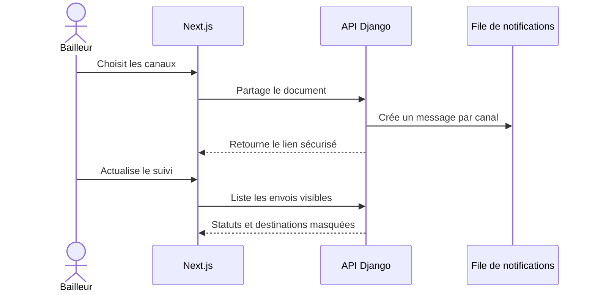

# Comprendre le suivi des envois

Le bailleur peut maintenant contrôler les messages SMS, email et WhatsApp depuis
l’écran **Documents**. Le suivi ne contacte aucun fournisseur : il lit l’état de
la file créée au jalon précédent.

## Flux complet



Le tableau affiche aussi les codes OTP demandés par le locataire. Chaque ligne
précise le canal, le statut, le nombre de tentatives et la dernière activité.

## Les quatre statuts

| Statut | Signification pour le bailleur |
| --- | --- |
| `QUEUED` | Le message attend un adaptateur ou sa prochaine tentative |
| `PROCESSING` | Un processus est en train de le remettre au fournisseur |
| `SENT` | Le fournisseur a accepté le message |
| `FAILED` | Toutes les tentatives ont échoué ou le message n’est plus valide |

`SENT` signifie que le fournisseur a accepté l’envoi. Cela ne garantit pas que le
téléphone du locataire était allumé ou que le message a été lu.

## API protégée

```http
GET /api/v1/notification-deliveries/
GET /api/v1/notification-deliveries/?document_id=<uuid>
GET /api/v1/notification-deliveries/?status=FAILED
GET /api/v1/notification-deliveries/?kind=OTP
```

Le sélecteur `visible_notification_deliveries_for` réutilise les droits d’accès
aux documents. Un bailleur ou copropriétaire ne voit donc que les notifications
des maisons auxquelles il a accès.

L’API ne renvoie jamais la destination complète dans cette liste : le téléphone
devient par exemple `***0800` et l’email `al***@example.com`. L’identifiant du
fournisseur et une erreur courte restent visibles pour faciliter le support.

## Frontend

Le composant `DocumentWorkspace` charge les documents et leur suivi ensemble.
Le bouton **Actualiser** relit les statuts depuis Django. Tout nouveau partage
apparaît immédiatement comme **En attente**.

L’intégration Mobile Money par webhook signé reste volontairement hors périmètre.
