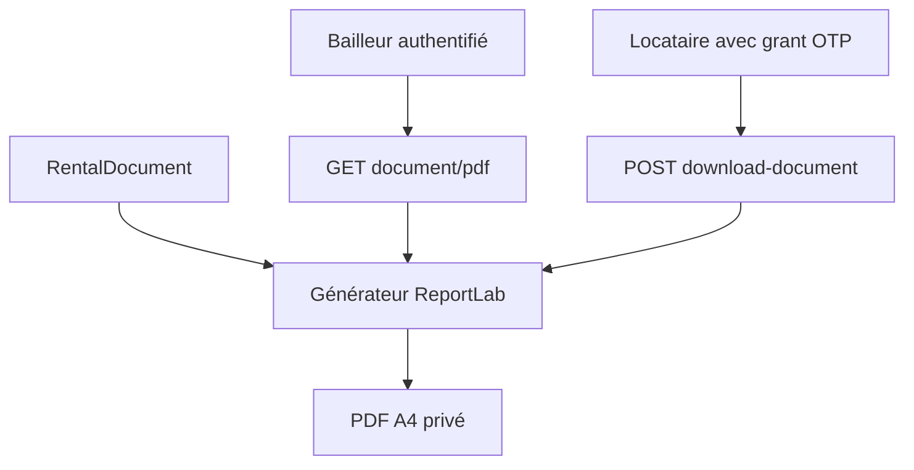

# Comprendre les reçus et quittances PDF

ImmoLib peut maintenant produire un véritable PDF A4 pour chaque reçu de
paiement et chaque quittance de loyer. Le fichier n’est pas stocké dans la base :
il est reconstruit à la demande depuis l’instantané `RentalDocument`.

## Pourquoi générer à la demande ?

- la base conserve une seule source de vérité ;
- une annulation apparaît immédiatement dans le PDF avec le statut `INVALIDE` ;
- aucun fichier périmé ne reste accessible dans un stockage séparé ;
- le même générateur sert au bailleur et au locataire.



## Deux autorisations différentes

Le bailleur télécharge depuis :

```http
GET /api/v1/documents/<document_id>/pdf/
```

Le `queryset` des documents vérifie les droits de propriété. Un autre bailleur
reçoit donc une réponse `404`, sans apprendre si le document existe.

Le locataire télécharge après la vérification OTP :

```http
POST /api/v1/public-access/download-document/
Content-Type: application/json

{"grant_token": "..."}
```

Le jeton d’accès temporaire est vérifié de nouveau au téléchargement. Un lien
révoqué, expiré ou lié à un document invalidé est refusé.

Les réponses PDF utilisent `Cache-Control: private, no-store` afin de demander
aux navigateurs et intermédiaires de ne pas conserver ce justificatif sensible.

## Contenu du PDF

Le fichier contient :

- la référence unique et le statut actuel ;
- le bailleur, le locataire et la maison ;
- la période locative et le moyen de paiement ;
- le montant en XOF et la date d’émission ;
- une explication différente pour un reçu partiel et une quittance complète ;
- un filigrane rouge et le motif lorsqu’un document est invalidé.

La police Vera fournie par ReportLab permet de conserver les accents et les noms
francophones. Le rendu a été vérifié sur une quittance active et un reçu invalidé.

## Frontend

Dans l’espace bailleur, chaque carte possède un bouton **PDF**. Sur la page
publique, le bouton **Télécharger le PDF** apparaît seulement après l’OTP. Le
client HTTP traite la réponse comme un `Blob` puis déclenche le téléchargement
avec un nom stable basé sur la référence.

Le webhook Mobile Money signé reste hors périmètre de ce jalon.
