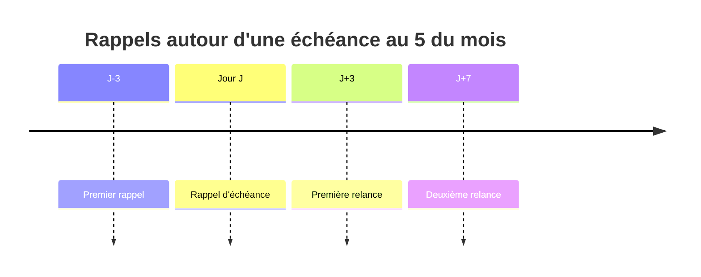

# Comprendre les rappels automatiques de loyer

Le cycle de facturation ImmoLib peut maintenant créer les rappels avant échéance
et les relances après retard. Ces messages utilisent la même file fiable que les
liens de document et les codes OTP.

## Planning par défaut



Le planning et les canaux sont configurables :

```dotenv
IMMOLIB_RENT_REMINDER_OFFSETS_DAYS=-3,0,3,7
IMMOLIB_RENT_REMINDER_CHANNELS=SMS
```

Un nombre négatif signifie « avant la date limite » et un nombre positif
signifie « après la date limite ». Le SMS est activé par défaut car chaque
locataire possède obligatoirement un téléphone. `EMAIL` et `WHATSAPP` peuvent
être ajoutés après configuration de leurs adaptateurs.

## Génération idempotente

`queue_rent_reminders` recherche uniquement les échéances dont le rappel tombe
aujourd'hui. Une contrainte unique porte sur :

```text
échéance + canal + date planifiée
```

Relancer le cycle dix fois le même jour conserve donc un seul message par canal.
Une échéance payée, contestée ou annulée est ignorée. Une adresse email absente
fait seulement sauter l'email ; elle ne bloque pas le SMS.

## Vérification tardive

Le message est construit au moment de l'envoi, pas lors de sa mise en file. Le
processeur relit alors le solde actuel et le nombre réel de jours de retard.

Si le locataire paie entre la création et l'envoi, le rappel passe en `FAILED`
avec un motif fonctionnel et aucun fournisseur n'est appelé. Cette vérification
évite une relance injustifiée après paiement.

## Évolution de `NotificationDelivery`

Une notification possède désormais exactement une source logique :

| Type | Source |
| --- | --- |
| `DOCUMENT_LINK` | lien sécurisé vers un reçu ou une quittance |
| `OTP` | défi de vérification rattaché au lien |
| `ACCOUNT_OTP` | défi privé de vérification ou récupération du compte |
| `RENT_REMINDER` | échéance de loyer et date planifiée |

Une contrainte de base de données vérifie cette cohérence. Le champ
`rent_charge` est nul pour les documents et obligatoire pour les rappels. Le
champ `account_challenge` est exclusivement réservé à `ACCOUNT_OTP`.

## Exécution quotidienne

```bash
python manage.py run_billing_cycle
```

Cette commande réalise maintenant trois opérations :

1. créer les échéances manquantes ;
2. actualiser les statuts temporels ;
3. placer les rappels du jour dans la file.

Le processeur reste séparé et peut tourner chaque minute :

```bash
python manage.py process_notifications --limit 100
```

## Suivi par le bailleur

L'écran Documents distingue les rappels de loyer, les liens de document et les
codes OTP d’accès aux documents. Les codes de compte restent hors de cet écran
pour ne pas exposer une opération de sécurité. Pour chaque message visible, il affiche la maison, le
locataire, le canal, le statut et les tentatives. Les destinations restent
masquées et les droits sont dérivés des copropriétés accessibles.

Le webhook Mobile Money signé reste volontairement hors périmètre.
