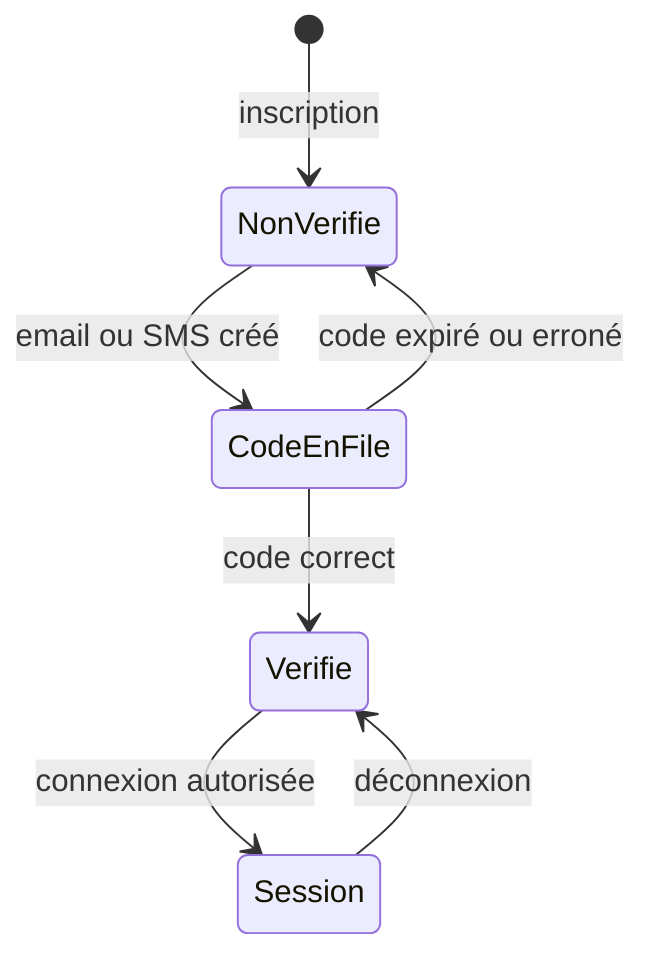
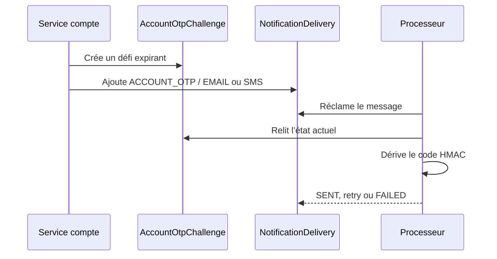

# Comprendre la vérification du compte

Ce jalon a commencé par une preuve de possession du téléphone. Le jalon 18
ajoute une activation par email afin de réduire le coût SMS, sans confondre les
deux preuves. Il conserve aussi un parcours de mot de passe oublié sans révéler
si un numéro possède un compte.

## Les états utiles

`phone_verified_at` et `email_verified_at` sont deux preuves durables et
indépendantes. Un code n’est qu’une preuve courte :
il possède une finalité, une expiration, un compteur d’essais et une date de
consommation.

## Deux finalités, aucune confusion

| Finalité | Condition | Résultat |
| --- | --- | --- |
| `PHONE_VERIFICATION` | téléphone non vérifié | vérifie uniquement le téléphone et ouvre une session |
| `EMAIL_VERIFICATION` | email présent et non vérifié | vérifie uniquement l’email et ouvre une session |
| `PASSWORD_RESET` | au moins un contact vérifié | email vérifié en priorité, sinon SMS |

Un code créé pour une finalité ne peut pas servir à l’autre, car la finalité
participe à sa signature HMAC et à la recherche en base.

## Pourquoi la file de notifications est réutilisée

`AccountOtpChallenge` appartient au domaine des comptes. `NotificationDelivery`
reste l’infrastructure commune pour remettre le message à un adaptateur SMS.
Le code n’est construit qu’au moment où le processeur réclame le message. Il
n’est donc ni stocké en clair dans le défi, ni copié dans la file.

## Limites de sécurité

La réponse d’une demande de récupération est générique. Le refroidissement
empêche les envois répétés, et cinq codes erronés consomment le défi. La logique
est protégée par des transactions et des verrous de ligne pour éviter que deux
requêtes concurrentes ne créent plusieurs codes ou ne consomment le même code.

L’email utilise Amazon SES via `IMMOLIB_EMAIL_NOTIFICATION_ADAPTER`. Le
téléphone n’est jamais marqué vérifié après un code email : une invitation de
copropriétaire liée au numéro attend donc toujours sa propre preuve. Aucun
webhook Mobile Money n’est ajouté par ce jalon.
