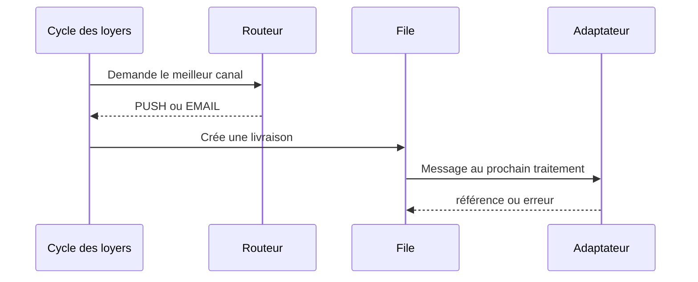

# Comprendre le jalon 18 : SES, push et partage manuel

## Le flux automatique



Le routeur ne contacte aucun fournisseur. Il choisit une destination disponible
selon les préférences, puis crée une livraison. Le processeur existant conserve
les essais, l’attente exponentielle et l’état final.

## Amazon SES

`AmazonSesEmailAdapter` reçoit un `NotificationMessage`, construit une version
texte et une version HTML UTF-8, puis appelle SES. Il ne connaît ni les baux ni
les échéances. Cette séparation permettra de remplacer SES sans modifier les
règles métier.

Configuration minimale :

```env
IMMOLIB_EMAIL_NOTIFICATION_ADAPTER=modules.notifications.adapters.AmazonSesEmailAdapter
AWS_SES_REGION=af-south-1
AWS_SES_FROM_EMAIL=no-reply@votre-domaine.ci
```

L’adresse ou le domaine d’envoi doit être vérifié dans SES. En environnement
SES sandbox, les destinataires doivent aussi être vérifiés.

## Push Firebase

Le navigateur demande l’autorisation, enregistre le service worker, obtient un
jeton FCM puis le transmet au backend. Le backend conserve le jeton par compte.
`FirebasePushAdapter` utilise Firebase Admin : aucune clé privée n’est envoyée
au navigateur.

## Partage manuel

Quand le bailleur choisit WhatsApp, email, partage natif ou copie :

1. le backend crée un lien sécurisé de 30 jours ;
2. il trace un `ManualShareEvent` ;
3. le frontend ouvre l’application choisie avec le message prérempli.

Ce mode ne coûte rien à ImmoLib et fonctionne pour un locataire sans compte.
Pour WhatsApp, le destinataire n’a pas besoin d’avoir enregistré le numéro du
bailleur, même si WhatsApp peut afficher les protections habituelles pour un
expéditeur inconnu.
