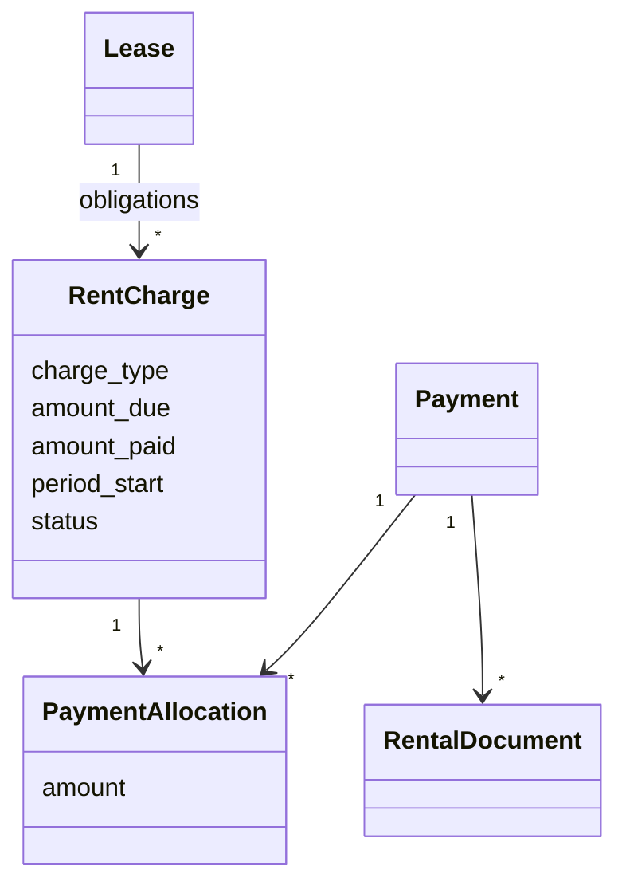

# Comprendre le paiement d'une caution ou de plusieurs mois

## 1. Le principe

Un paiement est un mouvement d'argent. Une obligation indique pourquoi cet
argent est dû. Une affectation relie les deux.



Le modèle Django s'appelle encore `RentCharge` pour garder la compatibilité
avec le code déjà construit, mais `charge_type` vaut maintenant `RENT` ou
`SECURITY_DEPOSIT`.

## 2. Pourquoi l'avance n'est pas un type

Une avance de trois mois signifie que trois mois précis sont payés. ImmoLib
génère donc trois obligations `RENT` et les affecte au même paiement. Cette
décision évite une somme sans période et permet de produire une quittance par
mois soldé.

## 3. Préparation du paiement

Le frontend appelle :

```text
POST /api/v1/lease-obligations/prepare-payment/
```

avec le bail, le premier mois, le dernier mois et l'indication d'inclure ou non
la caution. Le backend crée seulement les obligations manquantes. Un nouvel
appel avec les mêmes périodes ne produit pas de doublons.

## 4. Enregistrement

Le frontend envoie ensuite :

```json
{
  "amount": "500000.00",
  "allocations": [
    {"obligation_id": "…", "amount": "200000.00"},
    {"obligation_id": "…", "amount": "100000.00"},
    {"obligation_id": "…", "amount": "100000.00"},
    {"obligation_id": "…", "amount": "100000.00"}
  ],
  "method": "CASH",
  "idempotency_key": "…"
}
```

Le service refuse :

- une affectation vers un autre bail ;
- plusieurs devises dans une opération ;
- un montant supérieur au solde ;
- une somme d'affectations différente du montant reçu ;
- un paiement sans affectation.

Ces règles empêchent la création involontaire d'un portefeuille interne.

## 5. Documents

Un paiement produit un reçu global avec le détail de la répartition. Ensuite :

- une caution totalement payée produit un reçu de caution `IMM-CAU-…` ;
- chaque mois totalement payé produit une quittance `IMM-QUT-…` ;
- une obligation partielle ne produit pas encore son document définitif.

Si le paiement est annulé, les soldes sont recalculés et les documents devenus
injustifiés sont invalidés, jamais supprimés.

## 6. Où lire le code

1. `apps/api/modules/billing/models.py` : types d'obligation.
2. `apps/api/modules/billing/services.py` : préparation caution et mois.
3. `apps/api/modules/payments/services.py` : contrôles et affectations.
4. `apps/api/modules/documents/services.py` : génération des documents.
5. `apps/web/src/components/payments/payment-workspace.tsx` : parcours utilisateur.
