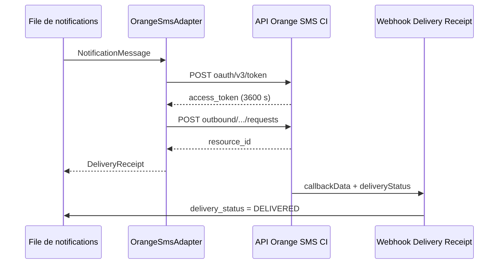

# Comprendre le jalon 21 : canal SMS Orange (Côte d'Ivoire)

## Pourquoi un canal SMS

WhatsApp et l'email supposent un téléphone connecté ou une boîte de réception
consultée. Pour les rappels de loyer et les quittances, le SMS reste le canal
le plus fiable en Côte d'Ivoire : un téléphone avec une ligne prépayée reçoit
toujours le message. Le canal s'insère dans la file existante comme un
adaptateur de plus.



## Corrélation : le clientCorrelator

L'envoi porte un `clientCorrelator` : l'identifiant (UUID) de la notification
en file. Orange le renvoie à l'identique dans le `callbackData` de l'accusé.
Le backend le stocke comme `provider_reference` : c'est cette clé qui permet
de marquer la notification `DELIVERED` sans jamais exposer le `resource_id`
(utile pour le support, tracé dans `SmsSendRecord`). Un UUID non énumérable
sert d'intégrité : un accusé ne peut affecter qu'une notification dont le
corrélateur est connu.

```env
IMMOLIB_SMS_NOTIFICATION_ADAPTER=modules.sms.adapters.OrangeSmsAdapter
ORANGE_SMS_CLIENT_ID=...
ORANGE_SMS_CLIENT_SECRET=...
ORANGE_SMS_SENDER_ADDRESS=tel:+2250000
ORANGE_SMS_DR_ALLOWED_IPS=1.2.3.4,5.6.7.8
```

## Coût par segment

Un SMS simple tient dans 160 caractères GSM-7 (ou 70 en UCS-2) ; au-delà, il
est découpé en segments de 153 (ou 67). Dès qu'un caractère hors GSM-7 de
base apparaît (`€`, emoji...), le message est compté en UCS-2 : les agrégateurs
ivoiriens basculent alors l'encodage, et l'estimation reste volontairement
prudente. Le coût `segments × ORANGE_SMS_COST_PER_SEGMENT_XOF` est tracé dans
`SmsSendRecord`.

L'adaptateur tronque un message trop long en conservant un éventuel lien de
document, et espace les envois pour respecter la limite officielle de 5 SMS
par seconde.

## Webhook sans signature

Orange ne signe pas ses webhooks. La protection repose sur le HTTPS, la
validation stricte du payload (`deliveryInfoNotification.{callbackData,
deliveryInfo.{deliveryStatus, address}}`) et la liste blanche d'IP
(`ORANGE_SMS_DR_ALLOWED_IPS`) : vide = 503, IP inconnue = 403.

Un même accusé reçu deux fois est absorbé (contrainte d'unicité sur
callbackData + statut). Un `DeliveryImpossible` n'écrase jamais un `DELIVERED`
déjà enregistré. Statuts reconnus : `DeliveredToTerminal` /
`DeliveredToNetwork` → `DELIVERED`, `DeliveryImpossible` → `FAILED`,
`MessageWaiting` → `PENDING_DR`, sinon `UNKNOWN` (tracé).

## File au moins une fois

Le worker peut rejouer un envoi après un crash : chaque envoi accepté par
Orange garde sa propre trace (`SmsSendRecord`, idempotent par `resource_id`),
la plus récente prévalant pour le nombre de segments de la notification.
